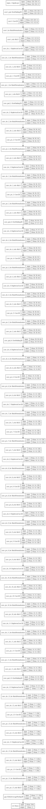

# Classification with Neural Networks

Today's workshop will cover the basics of neural networks for computer vision, specifically to recognize whether an object is within an image or not.

What is a neural network you may ask? Put simply, a neural network takes an input such as an image and applies differentiable operations to transform the input into a useful prediction. Let F(X) -> Y represent our neural network which takes an image X, and returns probability Y [0-1] which indicates how likely an object is within an image.

Since the operations are all differentiable, we can compute the gradient of the error (partial derivative of the error with respect to each input), and use it to move the networks coeffecients and biases (weights) towards making a correct prediction. The error or "loss" of our neural network is most simply stated as the absolute difference between Y_true and Y_prediction. In this workshop, Y_true represents whether an image contains a cell phone, and Y_pred represents the prediction the network makes with its operations and weights. The closer these two values, the lower the error. During "training", we attempt to iteratively minimize the loss by providing many examples to the neural network. 

The neural network we are using today is called MobileNet, which is a neural network which was created to be computationally efficient for deployment on devices such as cell phones. MobileNet takes a 224x224x3 (height x width x channels) image as an input. We add a final layer onto the final layer of MobileNet which represents the probability of whether our class is present within the image. MobileNet contains a few different types of layers which we detail below.

### Conv2D (and several of its variants)

- Two dimensional convolution, or a "sliding window" going accross an image outputing a dot product of each window as the output. The window is called a "kernel", and the neural network learns the values of each kernel.

### BatchNormalization

- Batch normalization "normalizes" its input batchwise. Let F(X) -> Y represent our batch normalization, where X has the shape Sample x Height x Width x Channel
- Y_sc = X_sc - mean(X_c) / std(X_c)
- Essentially, we compute the mean and standard deviation of each channel accross every sample in the batch, and use them to normalize each channel.

### ReLU

- Rectified linear activation unit.
- y = x, x in [0, inf]
- y = 0, x in [-inf, 0]
- This is used to add "nonlinearities" to the network to help it learn more complex relationships. ReLU in particular has the advantage that it helps address the "vanishing gradient" problem, where the gradient becomes so small numerically the network is not able to discern which way to update the weights.

### Dense

- Densely connected layer, meaning that each unit or "dimension" in the densely connected layer is connected to every previous unit, and every next unit.

## MobileNet Classification Architecture

